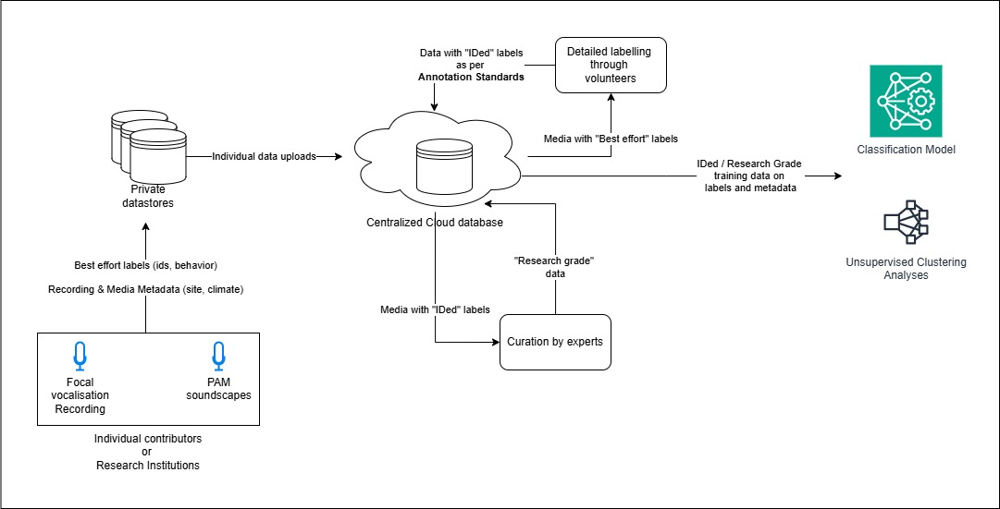

# Towards Centralised Bioacoustics Database: Standardised Annotations 

<Write this toward the end>


## Context

With emergence of AI/ML, there is a significant opportunity of low cost biodiversity conservation in India and global south using bio-acoustics monitoring. Today, researchers lack access to any large, labeled datasets of focal and PAM bio-acoustics recordings of Indian Taxa. While XX annotated biodiversity databases exist world wide, only YY are open to all and none focusing on Indian Taxa. See references. Lack of large, labelled bio-acoustics data sets acts as limitation in building and training AI / ML models that could be used by researchers, conservationists, citizen scientists and policy makers to draw inferences from large scale PAM data on bio-acoustics monitoring.  

 To solve these gap, we propose building the first ever centralized cloud hosted, query-able bio-acoustics database of Indian taxa with metadata and annotations. This will ideally be accessible to researchers, conservationists, citizen scientists and data scientists through a web portal for upload, labeling of data and annotations and download of annotated data. This annotated database will enable large clustering analyses and ML models for classification tasks aiding biodiversity monitoring and conservation of Indian taxa.

To create such a database, there is a need for proposing best practices for adding labels to raw acoustic files, that could be used by volunteers, researchers and citizen scientists to create large annotated datasets to be uploaded to the centralized database. 

The following flow chart represents steps needed to convert field recordings without annotations to annotated data to be uploaded into the database on a server. This database will serve users looking for data sets as well as train ML models.



## Guiding Principles

The document uses the following mental models to propose the best practices on annotations –

1. Attaching detailed, even if unstructured, contextual information should be prioritized over complying to a schema 
1.  Annotation formats should be human readable and comprehensible 
1.  Existing bio-diversity data standards should be used as a base, such as Darwin/Audubon Core, reusing their schemas and vocabulary 
1.  Practices and format should stay compatible with existing, popular annotation tools such as Raven, Kaleidoscope, Whombat, etc
1.  Redundancy of effort should be avoided through a hierarchical meta-data structure
1.  Whereever applicable latest tools such as collaborative labeling softwarel, LLMs should be leveraged to aid large scale annotations

## Prior Art

### A. Biodiversity occurance/event metadata 

On comparing the standards most widely used bio-diversity databases, it is clear that [Darwin Core](https://dwc.tdwg.org/) and its extensions, such as Events Core, Audio Visual/Arbimon Core, etc. have become the go to standard for recording taxa occurrences/events and are being increasingly adopted to varying degree by almost all platforms. Darwin Core (DwC) standards are maintained by [TDWG](https://www.tdwg.org/), which also provide taxon [ontology](https://github.com/tdwg/ontology) which can be useful for annotations in curated datasets. 

Arbimon and Kaleidoscope have been included in the comparison below because while they aren't open bio-diversity occurance platforms, their metadata and contextual labels can act as a refernce for our use case where bio-diversity is recorded and measured primarily via acoustic recordings. 


| **Feature**                        | **[GBIF](https://www.gbif.org/)**                                                           | **[OBIS](https://obis.org/)**                                                           | **[iNaturalist](https://www.inaturalist.org)**                                                  | **[eBird](ebird.org)**                                                          | **[Arbimon](https://arbimon.org/)**                                                        | **[Kaleidoscope](https://www.wildlifeacoustics.com/products/kaleidoscope-pro)** | **[xeno-canto](https://xeno-canto.org/)** |
|-----------------------------------|----------------------------------------------------------------------------------------------|------------------------------------------------------------------------------------------|--------------------------------------------------------------------------------------------------|----------------------------------------------------------------------------------|----------------------------------------------------------------------------------|----------------------------------------------------------------------------------|--------------------------------------------|
| **Purpose**                       | Global biodiversity occurrence                                                               | Marine species occurrence                                                                 | Citizen-science observations (all taxa)                                                         | Citizen-science bird observations                                                | PAM Analytics Software                                                           | PAM Analytics Software                                                           | Bird sound sharing and identification       |
| **Schema Type**                   | Darwin Core Archive (DwC-A)                                                                  | DwC + OBIS-ENV                                                                           | Custom JSON                                                                                      | [EBD](https://ebird.org/data/download)                                            | Custom (CSV/JSON) on DwC                                                        | Custom (CSV)                                                                      | Custom (CSV-like; tab-delimited)            |
| **Metadata Standards Used**       | ✅ DwC, AC                                                                                    | ✅ DwC, OBIS-ENV, ISO 19115                                                               | ✅ Custom (DwC mapped)                                                                            | ⚠️ Custom (partially DwC mapped)                                                 | ⚠️ Custom (limited DwC mapped)                                                  | ⚠️ Custom                                                                          | ⚠️ Custom                                   |
| **Ontologies / Vocabularies Used**| ✅ TDWG vocab, DwC, AC terms                                                                  | ✅ TDWG vocab, OBIS-ENV, WoRMS                                                            | ⚠️ Internal (DwC mapped)                                                                         | ⚠️ Custom (partially DwC mapped)                                                 | ⚠️ None; Custom labels                                                           | ❌ None; Custom labels                                                            | ❌ None; Custom labels                        |
| **Taxonomic Backbone**            | ✅ GBIF                                                                                       | ✅ WoRMS                                                                                  | ✅ iNat taxonomy (GBIF linked)                                                                   | ✅ Clements                                                                      | ⚠️ GBIF or custom                                                                | ⚠️ User defined                                                                   | ✅ IOC World Bird List                      |
| **Multimedia Support**            | ✅ AC                                                                                        | ✅ Media via URIs, DwC extensions                                                        | ✅ Images, audio, video                                                                          | ⚠️ Limited to checklists                                                        | ✅ Audio files, spectrograms                                                    | ✅ Audio files, spectrogram                                                     | ✅ Audio                                    |
| **Geospatial Metadata**           | ✅ Coordinates, geodetic datum                                                               | ✅ Geospatial + bathymetric                                                              | ✅ Coordinates + accuracy radius                                                                 | ✅ Site codes + optional GPS                                                     | ✅ Coordinates, elevation, site                                                 | ⚠️ Optional; site name                                                           | ✅ Country, region, locality                 |
| **Temporal Metadata**             | ✅ ISO 8601 fields                                                                           | ✅ `eventDate`  + eventDuration                                                          | ✅ Timestamp                                                                                      | ✅ Checklist Times                                                               | ✅ Recording start/end timestamp                                                | ✅ Start/end time per detection in seconds                                        | ✅ Date and time                            |
| **Behavior / Call Type**          | ⚠️ Minimal via `occurrenceRemarks`                                                          | ⚠️ Rare                                                                                   | ✅ Custom labels (optional)                                                                      | ✅ Custom labels (optional)                                                      | ✅ Call type, behavior tag, classifier metadata                                  | ✅ User labels (optional)                                                        | ⚠️ Free-text notes                          |
| **Hierarchical Taxonomy**         | ✅ Full taxonomic hierarchy                                                                  | ✅ Marine taxonomic hierarchy                                                            | ✅ Hierarchical view of species                                                                  | ✅ Species + subspecies                                                          | ❌ Free form labels                                                              | ❌ Free form labels                                                              | ✅ Genus  + species                  |
| **Environmental Metadata**        | ⚠️ Extensions / `dynamicProperties`                                                         | ✅ OBIS-ENV (depth, salinity, etc.)                                                      | ⚠️ User-defined                                                                                  | ⚠️ Limited effort-based                                                         | ✅ Site, habitat, environmental                                                  | ❌ User labels (optional)                                                       | ❌ Not supported                             |
| **Confidence / Quality Indicators**| ⚠️ Publisher QA/QC + data flags                                                             | ⚠️ QC pipelines                                                                          | ✅ Community-curated (Casual vs. research-grade)                                                  | ✅ Review system + filters                                                       | ✅ Classifier score; expert review                                              | ✅ Manual/classifier score                                                       | ⚠️ Community votes                          |
| **Data Access Format**            | ✅ DwC-A, CSV, API, RDF                                                                      | ✅ DwC-A, API                                                                            | ✅ API (JSON), CSV/DwC export                                                                    | ✅ EBD (CSV), checklist export                                                  | ✅ CSV export, dashboard access                                                  | ✅ CSV export, Custom formats                                                   | ✅ Bulk download (CSV), API                 |
| **Open Data Licensing**           | ✅ CC BY, CC0                                                                                | ✅ Creative Commons                                                                      | ✅ User-specified (default: open)                                                                | ✅ Mostly open (EBD)                                                             | ⚠️ Some restrictions; case-by-case                                              | ⚠️ User-controlled                                                              | ✅ CC licenses (BY-NC)                      |


### B. Acoustic data labels
The table below compares key features of popular acoustics labeling tools. Apart from the listed differences, we find that almost all schemas have common mandatory keys, such as `start_time`, `end_time`, `min_frequency`, `max_frequency` along with support for free form annotations, which is important for Guiding Principles 1 and 4.
| Feature						|  	Raven 	    |	Praat			| Audacity		 	| Kaleidoscope	|	ELAN	 |	Whombat				|
|-------------------------------|---------------|-------------------|---------------------|---------------|------------|----------------------|
| File Format					|  csv/tsv		| TextGrid		|txt		|	csv/tsv		|xml	| csv/tsv	        |
| Readability					|  	High		| Medium		|High		|High			|Low    | High	            |
| Native Frequency attributes	    |   ✅			|  ❌			| ❌			| ✅			| ✅	|  ✅		        |
| Heirarchical labels			|  	 ❌			|  ✅			| ❌			| ❌				| ✅    |  ❌		        |
| Overlapping annotations		|  	 ✅			|  ✅			| ❌			| ✅			| ✅    |  ✅		        |
| Free text  notes				|  	 ✅			|  ✅			| ✅		| ✅			| ✅	|  ✅			    |
| Mandatory species ID field	|  	 ✅			|  ❌			| ❌			| ✅			| ❌		|  ✅				|		
| Support for many media files	|   ✅			|  ✅			| ❌			| ✅			|       |  ✅		        |
| Custom key support			|  	 ✅ (Pro)	|  ✅			| ❌			| ❌				| ✅	|  ✅               |
| Meta data support				|   ❌			|  ❌			| ❌			|Separate file	| ❌	    | Separate File		|


Hence, we propose that all labels in audio selections within media files should contain the following keys:

| Column Name              |Mandatory| Description |
|--------------------------|---------|-------------|
| `LowFreq (kHz)`          | No		 | Lower frequency bound of selection |
| `HighFreq (kHz)`         | No		 | Upper frequency bound |
| `Begin Time (s)`         | Yes	 | Start time of selection in seconds |
| `End Time (s)`           | Yes	 | End time of selection in seconds |
| `Channel`                | No		 | Audio channel number, 1 if mono 2 if stereo |
| `Species Code`           | No		 | Species ID code (e.g., "Epfus" for *Eptesicus fuscus*) |
| `Common Name`            | Yes 	 | Common species name (optional) |
| `Notes`                  | Yes	 | Elaborate free text notes on species, behavior, call type, etc. Refer [Notes](#Notes) |
| `Annotation Date`        | Yes	 | When annotation was made. Needed for [Versioning](#Versioning) |
| `Annotator`              | Yes	 | Annotator's name or email. Needed for [Versioning](#Versioning) |
| `Previous Notes`         | No 	 | Recommended for [Versioning](#Versioning) |
	


## Recommended annotation best practices

Any soundscape data, labelled to varying degrees of detail, can prove to be useful in understanding the health of a habitat. Focal recordings can act as training/validation/test examples while training a classification model; Unsupervised clustering analyses can be run on large files from passive monitoring, which may be poorly annotated but with rich metadata of location, climate and context to understand changes in population, behavior, migration patterns at a larger spatial and temporal scale. 

Hence, we propose splitting the information into heirarchical tiers using a folder structure where multiple media files which are part of a single project or event should be maintained together in the manner described below. Details of the event should be added in `occurance.csv` and `event.csv` in DwC standard along with links to audio in  `multimedia.csv`.

Finally, the detailed labels on acoustic time series or spectrogram should be listed in `acoustic.csv`, in a format similar to Raven's. We recommend using detailed free form text, in the `notes` field, to describe  ided species, call type, environmental sounds, behaviour, confidence of id and any other labels that may be possible. Detailed examples of how such unstructured labels can be translated into predefined schemas is elaborated in [Using Audio enncoders and LLMs](#using-audio-enncoders-and-llms).


    base project folder/
    ├── readme.md              ← (Optional) A text file describing the project/event for which the media    has been collected
    ├── occurrence.csv         ← Core DwC file
    ├── event.csv         	   ← (Optional) Event Core extension describing the  recording event
    ├── multimedia.csv         ← Audubon (Audio visual) Core extension
    ├── acoustic.csv	       ← csv structure similar to raven etc with detailed free text annotations is `Notes` key 
    ├── audio_media/           ← Folder containing audio files to be referred in multimedia.csv
    └── visual_media/          ← Folder containing video/image files to be referred in multimedia.csv

#### 🧬 `occurrence.csv`
    occurrenceID,scientificName,eventDate,decimalLatitude,decimalLongitude,recordedBy,identifiedBy,occurrenceRemarks
    	urn:uuid:123e4567-e89b-12d3-a456-426614174000,Spizella passerina,2025-04-15T08:30:00Z,34.0522,-118.2437,Jane Doe,Jane Doe,"Observed near park entrance. Singing frequently."

#### 📅 `event.csv`

    eventID,eventDate,samplingProtocol,samplingEffort,habitat
    event1,2024-10-12T05:10:00Z,"ARU 10-min schedule","10 min every hour","Urban woodland edge"

#### 🎧 `multimedia.csv`
	identifier,type,format,subject,creator,description,license,audience,derivedFrom
	https://example.org/media/birdsong123.mp3,Sound,audio/mpeg,Spizella passerina,Jane Doe,"Chipping Sparrow singing in spring morning",https://creativecommons.org/licenses/by-nc/4.0/,ornithologists,urn:uuid:123e4567-e89b-12d3-a456-426614174000
	https://example.org/media/image123.jpg,StillImage,image/jpeg,Spizella passerina,Jane Doe,"Photo of the observed bird perched on fence",https://creativecommons.org/licenses/by-nc/4.0/,birders,urn:uuid:123e4567-e89b-12d3-a456-426614174000

#### acoustic.csv
```
Selection,View,Channel,Begin Time (s),End Time (s),Low Freq (Hz),High Freq (Hz),Delta Time (s),Delta Freq (Hz),File,Notes
1,        1,    1,      3.250,          3.450,        2000,          4500,          0.200,            2500,          forest_birds.wav, "Very likely song of Spizella passerina and chips of Junco hyemalis"
2,        1,    1,      7.100,          7.280,        1500,          5000,          0.180,            3500,          forest_birds.wav, "Roosting calls of Hill myna in canopy. Parakeet calls likely malabar or plum-headed"
3,        1,    1,      12.540,        12.700,        2500,          6000,          0.160,            3500,          forest_birds.wav, "Trill of unknown passerine. Buzzing insect. Rain patter."
4,        1,    1,      15.900,        16.050,        1000,          3000,          0.150,            2000,          forest_birds.wav, "White cheeked or Brown-headed barbet song. Southern coucal in background."
```

## Using Audio enncoders and LLMs
To be done.


## Versioning
To be discussed. Since the media and associated labels/metadata is not yet centrally managed, enforcing a versioning standard may be difficult. The suggested labelling schema does soft enforce versioning through `Annotator`, `Annotation Date` and `Previous Note`

## Data Licensing and Compliance
To be discussed.


